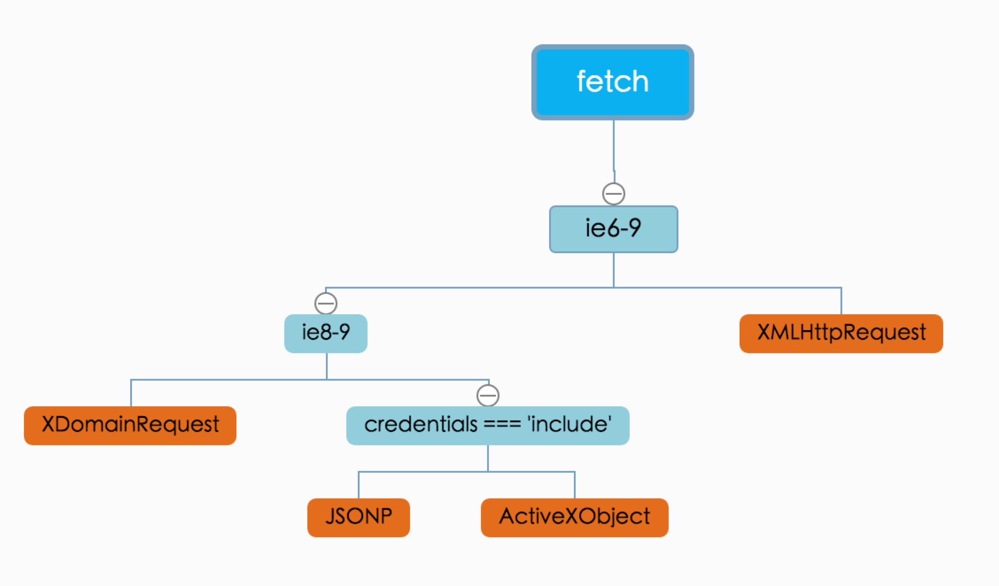

# fetch-polyfill
fetch polyfill which supports all mainstream browsers, even  IE6, IE7, IE8.....

```
$ npm install fetch-polyfill2 --save
$ npm install bluebird -- save
$ npm install json3 -- save
```




### HTML

```javascript
fetch('/users.html')
  .then(function(response) {
    return response.text()
  }).then(function(body) {
    document.body.innerHTML = body
  })
```

### JSON

```javascript
fetch('/users.json')
  .then(function(response) {
    return response.json()
  }).then(function(json) {
    console.log('parsed json', json)
  }).catch(function(ex) {
    console.log('parsing failed', ex)
  })
```

### Response metadata

```javascript
fetch('/users.json').then(function(response) {
  console.log(response.headers.get('Content-Type'))
  console.log(response.headers.get('Date'))
  console.log(response.status)
  console.log(response.statusText)
})
```

### Post form

```javascript
var form = document.querySelector('form')

fetch('/users', {
  method: 'POST',
  body: new FormData(form)
})
```

### Post JSON

```javascript
fetch('/users', {
  method: 'POST',
  headers: {
    'Accept': 'application/json',
    'Content-Type': 'application/json'
  },
  body: JSON.stringify({
    name: 'Hubot',
    login: 'hubot',
  })
})
```

### File upload

```javascript
var input = document.querySelector('input[type="file"]')

var data = new FormData()
data.append('file', input.files[0])
data.append('user', 'hubot')

fetch('/avatars', {
  method: 'POST',
  body: data
})
```

###IE6-7 cors

涉及到的参数

jsonpCallbackFunction :  后端生成的函数名, 不传自动生成,与jQuery一致
jsonpCallback: 链接中的名字,不传为`callback`,与jQuery一致
charset: 设置script的字符集

>所有情况下,想跨域,都需要手动设置 credentials: 'include'
>所有情况下,如果想发送请求,想带着cookie, 都需要设置  credentials: 'include'


```javascript
fetch('/users', { //jsonp!!!
  credentials: 'include',
}).then(function(response){
   return response.json()
}).then(function(){

})
```

###使用fetch下载HTML乱码问题

```
fetch('http://tieba.baidu.com')
    .then(res=> res.blob())
    .then(blob => {
        var reader = new FileReader();
        reader.onload = function(e) {
          var text = reader.result;
          console.log(text)
        }
        reader.readAsText(blob, 'GBK') //或 UTF8,逐个试
    })
```

更多用法见这里 http://www.w3ctech.com/topic/854